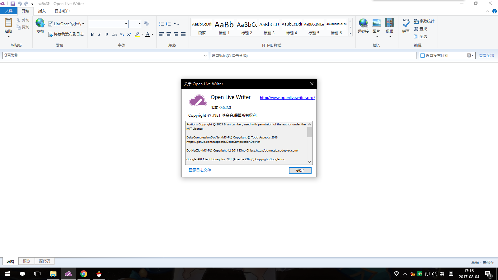

# OpenLiveWriter.Localization.zh-CN
Chinese translation for OpenLiveWriter 0.6.2.0  
注意！：该补丁只适用于最新版 0.6.2.0 ！    
目前该补丁可能还有未汉化部分，如有发现请在issue中提出。

## 如何使用
1，下载该 [DLL文件](https://github.com/LiarOnce/OpenLiveWriter.Localization.zh-CN/raw/master/OpenLiveWriter.Localization.dll)  
2，定位到 Open Live Writer 主程序目录（一般是 app-0.x.x ）。  
3，复制并将主程序目录中的原 DLL 文件替换为下载的 DLL 文件即可。

## 截图
就这样了：  

## 感谢

大部分汉化内容：[chonghua/OpenLiveWriter-zh-CN](https://github.com/chonghua/OpenLiveWriter-zh-CN)
